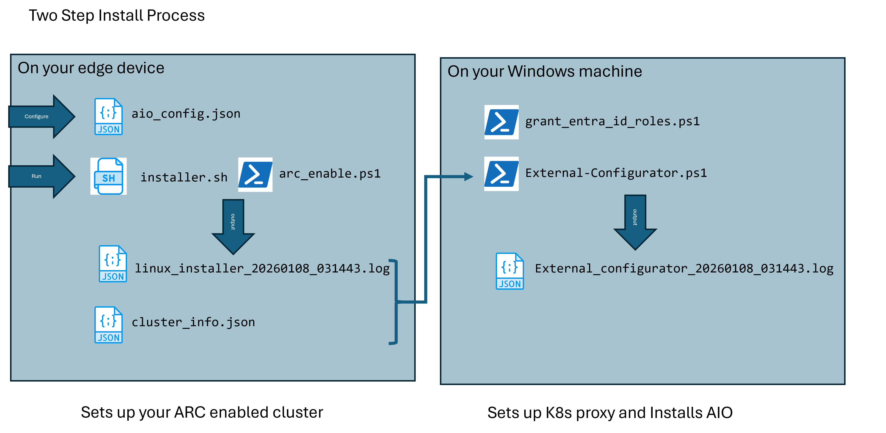
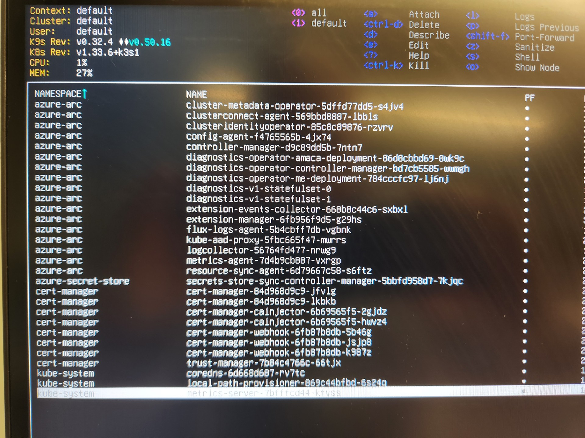
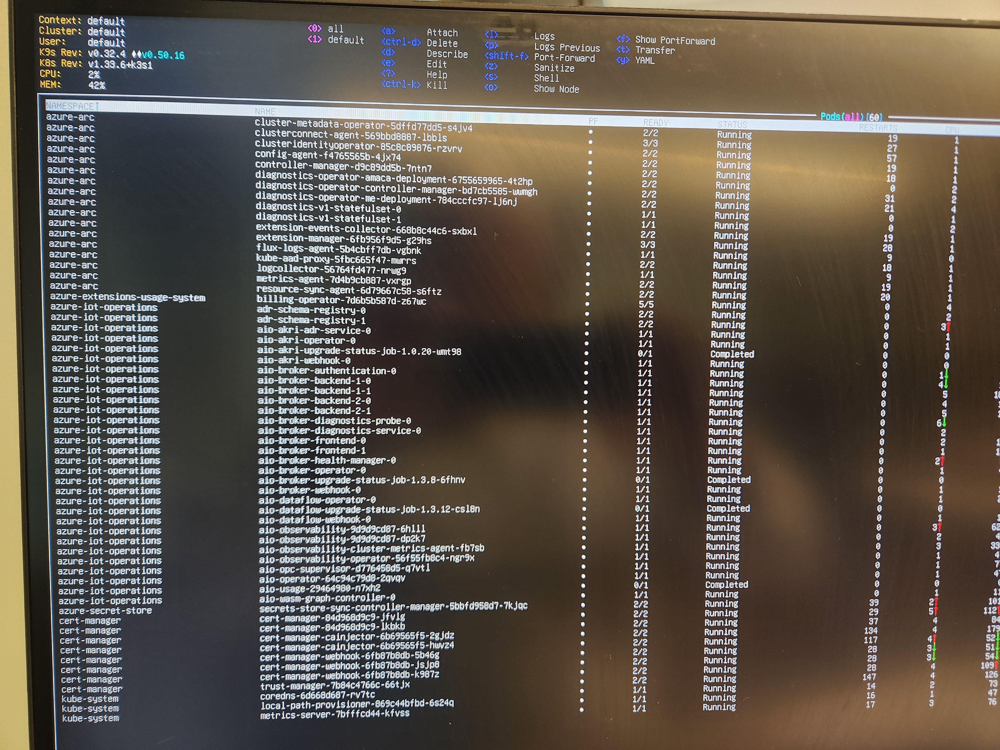
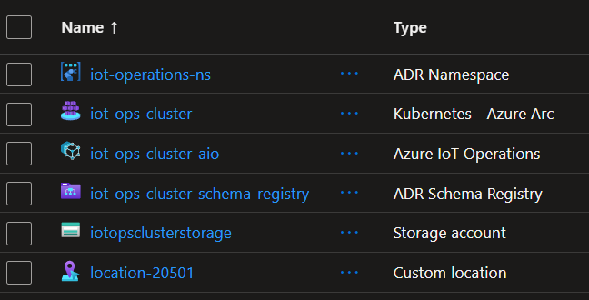

# Azure IoT Operations - Quick Start

Automated deployment of Azure IoT Operations (AIO) on edge devices with industrial IoT applications.

## What You Get

- ⚡ **One-command edge setup** - Automated K3s cluster with Azure IoT Operations
- 🏭 **Industrial IoT apps** - Factory simulator, MQTT historian, data processors
- ☁️ **Cloud integration** - Microsoft Fabric Real-Time Intelligence connectivity
- 🔧 **Production-ready** - Separation of edge and cloud configuration for security
- TBD - Windowns AIO installer - comming soon

> **For detailed technical information, see [README_ADVANCED.md](README_ADVANCED.md)**

## Why not use codespaces form the docs? 
The docs have a very clean "one click" deployment in the MSFT docs. It's a great first step, especially if you just want to see the tools. 
* That will live in it's own environment and you won't be able to connect it to your signals or your devices. 
* This version will help you set up AIO in the actual environment where you do your IoT operations.
* This is much closer to a production-level deployment.
* This instance will last as long as you want to keep it.

As the end-goal is an IoT solution, this repo has a preference for installing on hardware over virtualization. The goal is that you can put this in your IoT environment, validate the build, and then migrate to a production version. 


# Quick Start
The goal here is to install AIO on a Ubuntu machine (like a local NUC, PC or a VM). So that you can get working quickly on your datflow pipelines and get data in fabric quickly. 

Once you have setup AIO via this process, you should be able to do everything that you want in the cloud without touching the Ubuntu machine again.




## Prerequisites

- **Hardware**: Ubuntu machine with 16GB RAM, 4 CPU cores, 50GB disk
- **Azure**: Active subscription with admin access
- **Network**: Internet connectivity (edge device and management machine)

## Installation

### 1. Clone Repository

```bash
git clone https://github.com/BillmanH/learn-iot.git
cd learn-iot
```

### 2a. Create and Complete Config File ⚠️ **DO THIS FIRST**

**Before running any installation scripts**, create and configure `aio_config.json`:

```bash
cd arc_build_linux
cp aio_config.json.template aio_config.json
```

Edit `aio_config.json` with your settings:
- Cluster name for your edge device
- Optional tools to install (k9s, mqtt-viewer, ssh)
- Azure AD principal for remote access (optional but recommended)

**This config file controls the edge deployment.** Review it carefully before proceeding.

### 3. Edge Setup (On Ubuntu Device)

```bash
cd arc_build_linux
bash installer.sh
```

**What it does**: Installs K3s, kubectl, Helm, CSI Secret Store driver, and prepares cluster for Azure IoT Operations  
**Time**: ~10-15 minutes  
**Output**: `config/cluster_info.json` (needed for next step)

> **Note**: System may restart during installation. This is normal. Rerun the script after restart to continue.

### 3b. Arc-Enable Cluster (On Ubuntu Device)

After installer.sh completes, connect the cluster to Azure Arc:

```bash
# Still on the edge device (PowerShell is installed by installer.sh)
pwsh ./arc_enable.ps1
```

**What it does**: 
- Logs into Azure (interactive device code flow)
- Creates resource group if needed
- Connects the K3s cluster to Azure Arc
- Enables required Arc features (custom-locations, OIDC, workload identity)

**Time**: ~5 minutes  
**Why on the edge device?**: Arc enablement requires kubectl access to the cluster, which isn't available remotely.


After this you should see the core arc-kubernetes components on your nuc device. 
You can also use the proxy service at:
```
az connectedk8s proxy --name <your-cluster> --resource-group <your resource group>
```
You'll need this when you get to troubleshooting later. 

> **Note**: If you need remote access via Arc proxy, see [README_ADVANCED.md](README_ADVANCED.md#azure-arc-rbac-issues) for RBAC setup.


### 4. Azure Configuration (From Windows Machine)

Transfer the `config/` folder to your Windows management machine, then:

```powershell
cd external_configuration

# First, grant yourself the required Azure permissions
.\grant_entra_id_roles.ps1

# Deploy Azure IoT Operations
.\External-Configurator.ps1
```

> **⚠️ IMPORTANT: You may need to run `grant_entra_id_roles.ps1` multiple times!**  
> The script grants permissions to resources that exist at the time it runs. If `External-Configurator.ps1` creates new resources (like Schema Registry) and then fails on role assignments, simply run `grant_entra_id_roles.ps1` again to grant permissions to the newly created resources, then re-run `External-Configurator.ps1`.

> **💡 MOST COMMON ISSUE: Moving to the next step before clusters are ready**  
> If you get errors, don't just re-run the script immediately. The error messages include troubleshooting steps - **read them carefully**. Common issues include:
> - Arc cluster showing "Not Connected" (check Arc agent pods on edge device)
> - Role assignment failures (run `grant_entra_id_roles.ps1` first)
> - IoT Operations deployment failing (ensure Arc is fully connected)
>
> Always verify the previous step completed successfully before moving on. Use `kubectl get pods -n azure-arc` on the edge device to confirm Arc agents are running.

**WARNING** the field `kubeconfig_base64` in cluster_info.json contains a secret. Be careful with that. 

**What it does**: Deploys AIO infrastructure (storage, Key Vault, schema registry) and IoT Operations  
**Time**: ~15-20 minutes  
**Note**: Arc enablement was already done on the edge device in step 3b




### 5. Verify Installation

SSH into your Linux edge device and run:

```bash
# Check pods are running
kubectl get pods -n azure-iot-operations

# View MQTT messages
kubectl logs -n azure-iot-operations -l app=aio-broker-frontend --tail=20
```

## Key Documentation

### Infrastructure & Setup

- **[Linux Build Steps](./arc_build_linux/linux_build_steps.md)** - Complete step-by-step guide for installing AIO on a fresh Linux system
- **[Config Files Guide](./config/readme.md)** - Configuration file templates and outputs
- **`arc_build_linux/installer.sh`** - Edge device installer (local infrastructure only)
- **`external_configuration/External-Configurator.ps1`** - Remote Azure configurator (cloud resources only)
- **`external_configuration/Deploy-EdgeModules.ps1`** - Automated deployment script for edge applications

### Applications & Samples

- **[Edge MQTT Simulator](./iotopps/edgemqttsim/README.md)** - Comprehensive factory telemetry simulator
- **[Edge Historian](./iotopps/demohistorian/README.md)** - SQL-based historian with HTTP API for querying historical MQTT data
- **[Fabric Integration](./fabric_setup/fabric-realtime-intelligence-setup.md)** - Connecting AIO to Microsoft Fabric

### Development Environment

Create the Python environment using uv:
```bash
uv sync
```

## What's Included

### Edge Applications (`iotopps/`)
- **edgemqttsim** - Factory equipment simulator (CNC, 3D printer, welding, etc.)
- **demohistorian** - SQL-based MQTT historian with HTTP API
- **sputnik** - Simple MQTT test publisher
- **hello-flask** - Basic web app for testing

### Key Directories
- **`arc_build_linux/`** - Edge device installation scripts (runs on Ubuntu)
- **`external_configuration/`** - Azure configuration scripts (runs on Windows)
- **`config/`** - Configuration files and cluster info outputs
- **`fabric_setup/`** - Microsoft Fabric Real-Time Intelligence integration
- **`operations/`** - Dataflow configurations for cloud connectivity
- **`modules/`** - Deployable edge modules and ARM templates

## Configuration

Customize edge deployment via `arc_build_linux/aio_config.json`:
- Cluster name for your edge device
- Optional tools (k9s, MQTT viewers, SSH)
- Azure AD principal for Arc proxy access

Customize Azure deployment via `config/linux_aio_config.json`:
- Azure subscription and resource group settings
- Location and namespace configuration
- Key Vault settings for secret management

## Next Steps

After installation:

1. **View MQTT messages**: See [README_ADVANCED.md](README_ADVANCED.md#monitoring-mqtt-traffic)
2. **Deploy applications**: See [README_ADVANCED.md](README_ADVANCED.md#deploying-edge-applications)
3. **Connect to Fabric**: See [README_ADVANCED.md](README_ADVANCED.md#fabric-integration)
4. **Troubleshooting**: See [README_ADVANCED.md](README_ADVANCED.md#troubleshooting)

## Documentation

- **[README_ADVANCED.md](README_ADVANCED.md)** - Detailed technical guide
- **[Bug Reports](operations/)** - Known issues and workarounds
- **[Application READMEs](iotopps/)** - Individual app documentation

## Support

- [Azure IoT Operations Docs](https://learn.microsoft.com/azure/iot-operations/)
- [K3s Documentation](https://docs.k3s.io/)
- [Issue Tracker](https://github.com/yourusername/learn-iot/issues)