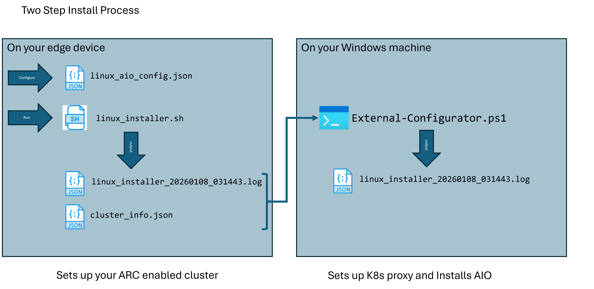
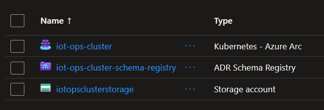

# Azure IoT Operations - Quick Start

Automated deployment of Azure IoT Operations (AIO) on edge devices with industrial IoT applications.

## What You Get

- ⚡ **One-command edge setup** - Automated K3s cluster with Azure IoT Operations
- 🏭 **Industrial IoT apps** - Factory simulator, MQTT historian, data processors
- ☁️ **Cloud integration** - Microsoft Fabric Real-Time Intelligence connectivity
- 🔧 **Production-ready** - Separation of edge and cloud configuration for security
- TBD - Windowns AIO installer - comming soon

> **For detailed technical information, see [README_ADVANCED.md](README_ADVANCED.md)**

## Why not use codespaces form the docs? 
The docs have a very clean "one click" deployment in the MSFT docs. It's a great first step, especially if you just want to see the tools. 
* That will live in it's own environment and you won't be able to connect it to your signals or your devices. 
* This version will help you set up AIO in the actual environment where you do your IoT operations.
* This is much closer to a production-level deployment.
* This instance will last as long as you want to keep it.

As the end-goal is an IoT solution, this repo has a preference for installing on hardware over virtualization. The goal is that you can put this in your IoT environment, validate the build, and then migrate to a production version. 


# Quick Start
The goal here is to install AIO on a Ubuntu machine (like a local NUC, PC or a VM). So that you can get working quickly on your datflow pipelines and get data in fabric quickly. 

Once you have setup AIO via this process, you should be able to do everything that you want in the cloud without touching the Ubuntu machine again.




## Prerequisites

- **Hardware**: Ubuntu machine with 16GB RAM, 4 CPU cores, 50GB disk
- **Azure**: Active subscription with admin access
- **Network**: Internet connectivity (edge device and management machine)

## Installation

### 1. Clone Repository

```bash
git clone https://github.com/BillmanH/learn-iot.git
cd learn-iot
```

### 2a. Create and Complete Config File ⚠️ **DO THIS FIRST**

**Before running any installation scripts**, create and configure `linux_aio_config.json`:

```bash
cd linux_build
cp linux_aio_config.template.json linux_aio_config.json
```

Edit `linux_aio_config.json` with your settings:
- Azure subscription ID (leave empty to use current login)
- Resource group name
- Location (e.g., "eastus")
- Cluster name
- Optional tools to install (k9s, mqtt-viewer, ssh)
- Edge modules to deploy (edgemqttsim, hello-flask, sputnik, wasm-quality-filter-python)

**This config file controls the entire deployment.** Review it carefully before proceeding.

### 2b. Login to Azure CLI

Before running the installer, authenticate with Azure:

```bash
az login
```

This authenticates your session. The edge installer will use this to:
- Create the resource group and Key Vault
- Arc-enable your cluster (if `enable_arc_on_install` is set to true in config)
- Store cluster credentials securely

**Note**: You only need to do this once per session. The credentials are used for both the edge setup and later Azure configuration.

### 3. Edge Setup (On Ubuntu Device)

```bash
cd linux_build
bash linux_installer.sh
```

**What it does**: Installs K3s, kubectl, Helm, and prepares cluster for Azure IoT Operations  
**Time**: ~10-15 minutes  
**Output**: `edge_configs/cluster_info.json` (needed for next step)

> **Note**: System may restart during installation. This is normal. Rerun the script after restart to continue.

After this you should see the core arc-kubernetes components on your nuc device. 
You can also use the proxy service at:
```
az connectedk8s proxy --name <your-cluster> --resource-group <your resource group>
```
You'll need this when you get to troubleshooting later. 

### 3b. Grant Azure AD Access to Cluster ⚠️ **REQUIRED FOR REMOTE ACCESS**

After linux_installer.sh completes successfully, run this command **on the edge device** to allow your Azure AD user to manage the cluster remotely via Arc proxy:

```bash
# Get your Azure AD Object ID (run on any machine with Azure CLI)
az ad signed-in-user show --query id -o tsv

# On the edge device, create the cluster role binding
kubectl create clusterrolebinding azure-user-cluster-admin \
  --clusterrole=cluster-admin \
  --user="<your-azure-ad-object-id>"
```

**Why this is needed**: When connecting via Arc proxy, Azure authenticates you with your Azure AD identity. K3s needs this binding to grant your identity cluster-admin permissions.

**Tip**: You can add this Object ID to the `manage_principal` field in `linux_aio_config.json` for reference.



### 4. Azure Configuration (From Windows Machine)

```powershell
# Configure Azure resources and connect edge cluster
cd linux_build
.\External-Configurator.ps1 -ConfigFile ".\edge_configs\cluster_info.json"
```
cd linux_build
.\External-Configurator.ps1 -ConfigFile ".\edge_configs\cluster_info.json"
```
**WARNING** the field `kubeconfig_base64` contains a secret. Be careful with that. 

**What it does**: Azure Arc enablement, AIO deployment, asset synchronization  
**Time**: ~15-20 minutes  
**Benefit**: No Azure credentials needed on edge device


### 5. Verify Installation

```bash
# Check pods are running
kubectl get pods -n azure-iot-operations

# View MQTT messages
kubectl logs -n azure-iot-operations -l app=aio-broker-frontend --tail=20
```

## Key Documentation

### Infrastructure & Setup

- **[Linux Build Steps](./linux_build/linux_build_steps.md)** - Complete step-by-step guide for installing AIO on a fresh Linux system
- **[K3s Troubleshooting Guide](./linux_build/K3S_TROUBLESHOOTING_GUIDE.md)** - Comprehensive troubleshooting reference for K3s cluster issues
- **[Azure Portal Setup](./aio_portal_setup.md)** - Guide for discovering and managing devices in Azure Portal
- **`linux_installer.sh`** - Edge device installer (local infrastructure only)
- **`External-Configurator.ps1`** - Remote Azure configurator (cloud resources only)
- **`Deploy-EdgeModules.ps1`** - Automated deployment script for edge applications
- **`Deploy-Assets.ps1`** - ARM template deployment script for Azure assets

### Applications & Samples

- **[Edge MQTT Simulator](./iotopps/edgemqttsim/README.md)** - Comprehensive factory telemetry simulator
- **[Edge Historian](./iotopps/demohistorian/README.md)** - SQL-based historian with HTTP API for querying historical MQTT data
- **[Fabric Integration](./Fabric_setup/fabric-realtime-intelligence-setup.md)** - Connecting AIO to Microsoft Fabric

### Development Environment

Create the Python environment using uv:
```bash
uv sync
```

## What's Included

### Edge Applications (`iotopps/`)
- **edgemqttsim** - Factory equipment simulator (CNC, 3D printer, welding, etc.)
- **demohistorian** - SQL-based MQTT historian with HTTP API
- **sputnik** - Simple MQTT test publisher
- **hello-flask** - Basic web app for testing

### Key Directories
- **`linux_build/`** - Installation scripts and ARM templates
- **`Fabric_setup/`** - Microsoft Fabric Real-Time Intelligence integration
- **`operations/`** - Dataflow configurations for cloud connectivity

## Configuration

Customize deployment via `linux_build/linux_aio_config.json`:
- Azure subscription and resource group settings
- Optional tools (k9s, MQTT viewers)
- Edge modules to deploy
- Fabric Event Stream integration

## Next Steps

After installation:

1. **View MQTT messages**: See [README_ADVANCED.md](README_ADVANCED.md#monitoring-mqtt-traffic)
2. **Deploy applications**: See [README_ADVANCED.md](README_ADVANCED.md#deploying-edge-applications)
3. **Connect to Fabric**: See [README_ADVANCED.md](README_ADVANCED.md#fabric-integration)
4. **Troubleshooting**: See [README_ADVANCED.md](README_ADVANCED.md#troubleshooting)

## Documentation

- **[README_ADVANCED.md](README_ADVANCED.md)** - Detailed technical guide
- **[Bug Reports](operations/)** - Known issues and workarounds
- **[Application READMEs](iotopps/)** - Individual app documentation

## Support

- [Azure IoT Operations Docs](https://learn.microsoft.com/azure/iot-operations/)
- [K3s Documentation](https://docs.k3s.io/)
- [Issue Tracker](https://github.com/yourusername/learn-iothub/issues)