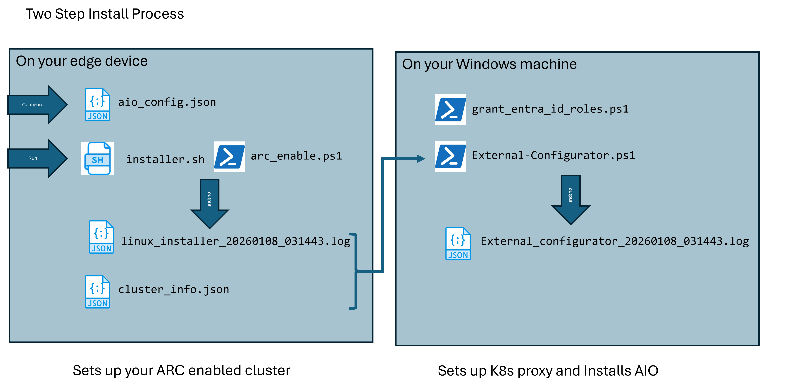
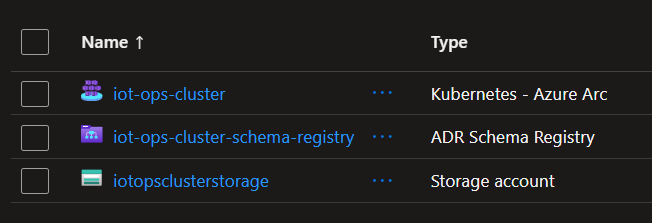
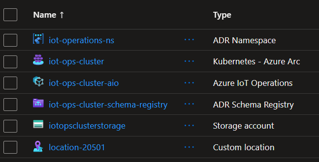

# Azure IoT Operations - Quick Start

Automated deployment of Azure IoT Operations (AIO) on edge devices with industrial IoT applications.

## Table of Contents

- [What You Get](#what-you-get)
- [Why not use codespaces from the docs?](#why-not-use-codespaces-from-the-docs)
- [Quick Start](#quick-start)
- [Prerequisites](#prerequisites)
  - [Hardware (Ubuntu / K3s path)](#hardware-ubuntu--k3s-path)
  - [Windows Management Machine](#windows-management-machine-required-for-all-paths)
- [Installation](#installation)
  - [Path A: Ubuntu / K3s](#path-a-ubuntu--k3s)
    - [1. Get the Repository](#1-get-the-repository)
    - [2a. Create and Complete Config File](#2a-create-and-complete-config-file--do-this-first)
    - [3. Edge Setup (Ubuntu)](#3-edge-setup-on-ubuntu-device)
    - [3b. Arc-Enable Cluster](#3b-arc-enable-cluster-on-ubuntu-device)
    - [4. Azure Configuration (Windows)](#4-azure-configuration-from-windows-machine)
    - [5. Verify Installation](#5-verify-installation)
  - [Path B: Single Windows Machine (AKS-EE)](#path-b-single-windows-machine-aks-ee)
- [Key Documentation](#key-documentation)
- [What's Included](#whats-included)
- [Configuration](#configuration)
- [Next Steps](#next-steps)
- [Support](#support)

## What You Get

- ⚡ **One-command edge setup** - Automated K3s cluster with Azure IoT Operations
- 🏭 **Industrial IoT apps** - Factory simulator, MQTT historian, data processors
- ☁️ **Cloud integration** - Dataflow pipelines to Azure (ADX, Event Hubs, Fabric) using **Managed Identity** — no secrets to manage.
- 🔧 **Production-ready** - Separation of edge and cloud configuration for security
- 💻 **Single-machine (AKS-EE)** - Run everything on one Windows laptop with session-bootstrap.ps1

> **For detailed technical information, see [README_ADVANCED.md](README_ADVANCED.md)**

## Why not use codespaces from the docs? 
The docs have a very clean "one click" deployment in the MSFT docs. It's a great first step, especially if you just want to see the tools. 
* That will live in its own environment and you won't be able to connect it to your signals or your devices. 
* This version will help you set up AIO in the actual environment where you do your IoT operations.
* This is much closer to a production-level deployment.
* This instance will last as long as you want to keep it.

As the end-goal is an IoT solution, this repo has a preference for installing on hardware over virtualization. The goal is that you can put this in your IoT environment, validate the build, and then migrate to a production version. 


# Quick Start
The goal here is to install AIO on an Ubuntu machine (like a local NUC, PC, or a VM) so that you can get working quickly on your dataflow pipelines and get data into Fabric quickly. 
* _if you are in a purely testing or validation phase you can create a quick VM using [this process](docs/quick_vm_build.md)_
* _if you are building on a Windows machine using AKS Edge Essentials, see the [Single Windows Machine (AKS-EE)](#path-b-single-windows-machine-aks-ee) section below._

> **Using AKS Edge Essentials (Windows-based edge)?**  
> Follow the [Deploy AIO on AKS Edge Essentials](https://learn.microsoft.com/en-us/azure/aks/aksarc/aks-edge-howto-deploy-azure-iot) guide to set up your edge cluster, then **skip to step 4** (Azure Configuration from Windows Machine) below. Steps 1–3b do not apply to AKS-EE.

Once you have setup AIO via this process, you should be able to do everything that you want in the cloud without touching the Ubuntu machine again.




### The process involves running four scripts:
#### On the edge machine:
1. arc_build_linux\installer.sh
2. arc_build_linux\arc_enable.ps1
#### On your Windows Machine:
3. external_configuration\grant_entra_id_roles.ps1
4. external_configuration\External-Configurator.ps1


Specific commands for them are below. 

**Note** Installing AIO can be different depending on your setup. In many cases, you have to run some scripts multiple times or in different order. The log messages in each script should tell you what to do next. 

## Prerequisites

### Hardware (Ubuntu / K3s path)
- **Hardware**: Ubuntu machine with 16GB RAM, 4 CPU cores, 50GB disk
- **Azure**: Active subscription with admin access
- **Network**: Internet connectivity (edge device and management machine)

### Windows Management Machine (required for all paths)
- **PowerShell 7+** (strongly recommended — 5.1 will produce a warning but may still work)  
  Download: <https://aka.ms/install-powershell>
- **Azure CLI ≥ 2.64.0**  
  Install: <https://aka.ms/installazurecliwindows>  
  Check version: `az --version`  
  Upgrade: `az upgrade`
- **Required CLI extensions** (install once, then update with `az extension update --name <ext>`):
  ```powershell
  az extension add --upgrade --name azure-iot-ops
  az extension add --upgrade --name connectedk8s
  ```
- **Execution Policy** — the scripts in this repo are unsigned. Run this once at the start of each PS session:
  ```powershell
  Set-ExecutionPolicy -ExecutionPolicy Bypass -Scope Process -Force
  ```

## Installation

### Path A: Ubuntu / K3s

### 1. Get the Repository

**Option A — Download ZIP** (no Git required):  
Click the green **Code** button on this GitHub page and choose **Download ZIP**, then extract to a local working directory.

**Option B — Clone with Git**:
```bash
# Install git if not already installed
sudo apt update && sudo apt install -y git

git clone https://github.com/BillmanH/learn-iot.git
cd learn-iot
```

### 2a. Create and Complete Config File ⚠️ **DO THIS FIRST**

**Before running any installation scripts**, create and configure `aio_config.json`:

```bash
cd config
cp quikstart_config.template aio_config.json
```

Edit `aio_config.json` with your settings:
- Cluster name for your edge device
- Optional tools to install (k9s, mqtt-viewer, ssh, and powershell)

**This config file controls the edge deployment.** Review it carefully before proceeding.

### 3. Edge Setup (On Ubuntu Device)

```bash
cd arc_build_linux
bash installer.sh
```

**What it does**: Installs K3s, kubectl, Helm, and prepares the cluster for Azure IoT Operations  
**Time**: ~10-15 minutes  
**Output**: `config/cluster_info.json` (needed for next step)

> **Note**: System may restart during installation. This is normal. Rerun the script after restart to continue.

### 3b. Arc-Enable Cluster (On Ubuntu Device)

After installer.sh completes, connect the cluster to Azure Arc:

```bash
# Still on the edge device (PowerShell is installed by installer.sh)
pwsh ./arc_enable.ps1
```

**What it does**: 
- Logs into Azure (interactive device code flow)
- Creates resource group if needed
- Connects the K3s cluster to Azure Arc
- Enables required Arc features (custom-locations, OIDC, workload identity)
- Configures K3s to use the Arc OIDC issuer (required for Key Vault secret sync)

**Time**: ~5 minutes  
**Why on the edge device?**: Arc enablement requires kubectl access to the cluster, which isn't available remotely.


After this you should see the core arc-kubernetes components on your edge device. 


> **Note**: If you need remote access via Arc proxy, see [README_ADVANCED.md](README_ADVANCED.md#azure-arc-rbac-issues) for RBAC setup.



### 4. Azure Configuration (From Windows Machine)

> **These scripts are idempotent** — it is normal and expected to run them multiple times. Common reasons include adjusting a parameter, recovering from a partial failure, or re-running `grant_entra_id_roles.ps1` after new resources have been created by `External-Configurator.ps1`. Each run picks up where it left off.

Choose one of three ways to provide your Azure settings to the scripts:

**Option A — Paste values directly in your terminal (quickest, no file editing)**

```powershell
$env:AZURE_SUBSCRIPTION_ID    = "your-subscription-id"
$env:AZURE_LOCATION           = "eastus2"            # e.g. eastus2, westus, westeurope
$env:AZURE_RESOURCE_GROUP     = "rg-my-iot"          # created if it does not exist
$env:AKSEDGE_CLUSTER_NAME     = "my-cluster"         # must be lowercase, no spaces
$env:AZURE_CONTAINER_REGISTRY = ""                   # short name only, e.g. myregistry (leave blank to auto-generate)

# Tenant ID is optional - only needed if you have multiple Azure tenants
# $env:AZURE_TENANT_ID = "your-tenant-id"           # az account show --query tenantId -o tsv

az login   # add --tenant $env:AZURE_TENANT_ID if you have multiple tenants
az account set --subscription $env:AZURE_SUBSCRIPTION_ID

cd external_configuration
Set-ExecutionPolicy -ExecutionPolicy Bypass -Scope Process -Force
.\grant_entra_id_roles.ps1
.\External-Configurator.ps1
```

> **Resource names** (Key Vault, Storage Account, Schema Registry) are not settable via environment variables — they auto-generate from the cluster/resource group name. To specify custom names, use Option C (`aio_config.json`) instead.

**Option B — Edit session-bootstrap.ps1 and run it (recommended if you do this repeatedly)**

Fill in the required variables in `external_configuration\session-bootstrap.ps1` and save. Then run it once per PS7 session — it sets all variables and logs you in automatically. This is especially useful if you open new terminal windows frequently or return to this setup over multiple sessions.
```powershell
$AZ_SUBSCRIPTION_ID    = "your-subscription-id"
$AZ_TENANT_ID          = ""   # optional - only needed if you have multiple Azure tenants
                               # az account show --query tenantId -o tsv
$AZ_LOCATION           = "eastus2"
$AZ_RESOURCE_GROUP     = "rg-my-iot"          # created if it does not exist
$AKS_EDGE_CLUSTER_NAME = "my-cluster"         # must be lowercase, no spaces
$AZ_CONTAINER_REGISTRY = ""   # short name only, e.g. myregistry (leave blank to auto-generate)

# Key Vault, Storage Account, and Schema Registry names are not
# settable here - they auto-generate. To customize them, use Option C.
```
```powershell
cd external_configuration
Set-ExecutionPolicy -ExecutionPolicy Bypass -Scope Process -Force
.\session-bootstrap.ps1
.\grant_entra_id_roles.ps1
.\External-Configurator.ps1
```

**Option C — Copy aio_config.json from the edge device (Linux/K3s path default, and the only option for custom resource names)**

Transfer the `config/` folder from your edge device to your Windows management machine (or copy `aio_config.json` directly). This is also the only way to specify custom names for Key Vault, Storage Account, and Schema Registry — leave them blank to auto-generate:
```json
{
  "azure": {
    "subscription_id": "your-subscription-id",
    "resource_group": "rg-my-iot",
    "location": "eastus2",
    "cluster_name": "my-cluster",
    "storage_account_name": "",   // leave blank to auto-generate
    "key_vault_name": "",         // leave blank to auto-generate
    "container_registry": ""      // leave blank to auto-generate
  }
}
```
```powershell
cd external_configuration
Set-ExecutionPolicy -ExecutionPolicy Bypass -Scope Process -Force
.\grant_entra_id_roles.ps1
.\External-Configurator.ps1
```

> **Note:** Options A and B override any values in `aio_config.json` and work for both the Linux/K3s path and the AKS-EE path.

> **Single-node or demo machine?** Add `-DemoMode` to `External-Configurator.ps1` to reduce broker RAM from ~15.8 GB to ~303 MiB — NOT for production use.

> **Grant permissions separately?** It may be that the person who has permission to assign Azure roles is different from the person deploying. Run `grant_entra_id_roles.ps1` first with the appropriate identity, then `External-Configurator.ps1` separately. To grant permissions to a specific user, pass their Object ID (not email):
> ```powershell
> # Get your Object ID: az ad signed-in-user show --query id -o tsv
> .\grant_entra_id_roles.ps1 -AddUser 12345678-1234-1234-1234-123456789abc
> ```

> **⚠️ IMPORTANT: You may need to run `grant_entra_id_roles.ps1` multiple times!**  
> The script grants permissions to resources that exist at the time it runs. If `External-Configurator.ps1` creates new resources (like Schema Registry) and then fails on role assignments, simply run `grant_entra_id_roles.ps1` again to grant permissions to the newly created resources, then re-run `External-Configurator.ps1`.

> **💡 MOST COMMON ISSUE: Moving to the next step before clusters are ready**  
> If you get errors, don't just re-run the script immediately. The error messages include troubleshooting steps - **read them carefully**. Common issues include:
> - Arc cluster showing "Not Connected" (check Arc agent pods on edge device)
> - Role assignment failures (run `grant_entra_id_roles.ps1` first)
> - IoT Operations deployment failing (ensure Arc is fully connected)
>
> Always verify the previous step completed successfully before moving on. Use `kubectl get pods -n azure-arc` on the edge device to confirm Arc agents are running.

**WARNING** the field `kubeconfig_base64` in cluster_info.json contains a secret. Be careful with that. 

**What it does**: Deploys AIO infrastructure (storage, Key Vault, schema registry) and IoT Operations  
**Time**: ~15-20 minutes  
**Note**: Arc enablement was already done on the edge device in step 3b




### 5. Verify Installation

SSH into your Linux edge device and run:

```bash
# Check pods are running
kubectl get pods -n azure-iot-operations

# View MQTT messages
kubectl logs -n azure-iot-operations -l app=aio-broker-frontend --tail=20
```

---

### Path B: Single Windows Machine (AKS-EE)

If you are running both AKS Edge Essentials (edge) and the Azure management scripts on the **same Windows laptop**, `session-bootstrap.ps1` is an optional convenience helper — or you can skip it entirely and paste values directly in your terminal.

#### Prerequisites
- PowerShell 7+ (`winget install Microsoft.PowerShell`)
- Azure CLI ≥ 2.64.0 (`winget install Microsoft.AzureCLI`)
- `azure-iot-ops` and `connectedk8s` extensions (see [Prerequisites](#prerequisites))

#### Workflow

**Step 1 — Set up your AKS-EE edge cluster**

Follow the [Deploy AIO on AKS Edge Essentials](https://learn.microsoft.com/en-us/azure/aks/aksarc/aks-edge-howto-deploy-azure-iot) guide. The `$global:*` variables set by `session-bootstrap.ps1` are picked up automatically if you use Option B below.

**Step 2 — Set your Azure context (choose one option)**

_Option A — Paste values directly in your terminal (quickest, no file editing):_

```powershell
$env:AZURE_SUBSCRIPTION_ID    = "your-subscription-id"
$env:AZURE_LOCATION           = "eastus2"            # e.g. eastus2, westus, westeurope
$env:AZURE_RESOURCE_GROUP     = "rg-my-iot"          # created if it does not exist
$env:AKSEDGE_CLUSTER_NAME     = "my-cluster"         # must be lowercase, no spaces
$env:AZURE_CONTAINER_REGISTRY = ""                   # short name only, e.g. myregistry (leave blank to auto-generate)

# Tenant ID is optional - only needed if you have multiple Azure tenants
# $env:AZURE_TENANT_ID = "your-tenant-id"           # az account show --query tenantId -o tsv

az login   # add --tenant $env:AZURE_TENANT_ID if you have multiple tenants
az account set --subscription $env:AZURE_SUBSCRIPTION_ID
```

> **Resource names** (Key Vault, Storage Account, Schema Registry) are not settable via environment variables — they auto-generate from the cluster/resource group name. To specify custom names, use Option B (session-bootstrap) which also reads from `aio_config.json`, or copy `aio_config.json` directly.

_Option B — Use session-bootstrap.ps1 (recommended if you do this repeatedly):_

Fill in the required variables in `external_configuration\session-bootstrap.ps1` and save. Run it once at the start of each PS7 session — it sets all variables, including the `$global:*` variables for the AKS-EE quickstart, and logs you in automatically. Especially useful if you open new terminal windows frequently.
```powershell
$AZ_SUBSCRIPTION_ID    = "your-subscription-id"
$AZ_TENANT_ID          = ""   # optional - only needed if you have multiple Azure tenants
                               # az account show --query tenantId -o tsv
$AZ_LOCATION           = "eastus2"
$AZ_RESOURCE_GROUP     = "rg-my-iot"          # created if it does not exist
$AKS_EDGE_CLUSTER_NAME = "my-cluster"         # must be lowercase, no spaces
$AZ_CONTAINER_REGISTRY = ""   # short name only, e.g. myregistry (leave blank to auto-generate)

# Key Vault, Storage Account, and Schema Registry names are not
# settable here - they auto-generate. To customize them, use aio_config.json.
```
```powershell
cd external_configuration
Set-ExecutionPolicy -ExecutionPolicy Bypass -Scope Process -Force
.\session-bootstrap.ps1
```

**Step 3 — Grant permissions and deploy AIO**

After either option above, run:
```powershell
.\grant_entra_id_roles.ps1
.\External-Configurator.ps1 -DemoMode   # -DemoMode recommended for single-machine setups
```

> To grant permissions to a specific user instead of yourself, pass their Object ID:
> ```powershell
> .\grant_entra_id_roles.ps1 -AddUser 12345678-1234-1234-1234-123456789abc
> ```

> **Tip**: Option A is the fastest way to get going — just paste and run. Option B is worth the one-time setup if you return to this workflow regularly or work across multiple terminal sessions.

## Key Documentation

### Infrastructure & Setup

- **[Config Files Guide](./config/readme.md)** - Configuration file templates and outputs
- **[Linux Build Advanced](./arc_build_linux/linux_build_steps.md)** - Advanced flags, troubleshooting, and cleanup scripts
- **`arc_build_linux/installer.sh`** - Edge device installer (local infrastructure only)
- **`external_configuration/External-Configurator.ps1`** - Remote Azure configurator (cloud resources only)
- **`external_configuration/Deploy-EdgeModules.ps1`** - Automated deployment script for edge applications

### Applications & Samples

- **[Edge MQTT Simulator](./modules/edgemqttsim/README.md)** - Comprehensive factory telemetry simulator
- **[Edge Historian](./modules/demohistorian/README.md)** - SQL-based historian with HTTP API for querying historical MQTT data
- **[Fabric Integration](./Fabric_setup/fabric-realtime-intelligence-setup.md)** - Connecting AIO to Microsoft Fabric

## What's Included

### Edge Applications (`modules/`)
- **edgemqttsim** - Factory equipment simulator (CNC, 3D printer, welding, etc.)
- **demohistorian** - SQL-based MQTT historian with HTTP API
- **sputnik** - Simple MQTT test publisher
- **hello-flask** - Basic web app for testing

### Key Directories
- **`arc_build_linux/`** - Edge device installation scripts (runs on Ubuntu)
- **`external_configuration/`** - Azure configuration scripts (runs on Windows)
- **`config/`** - Configuration files and cluster info outputs
- **`fabric_setup/`** - Microsoft Fabric Real-Time Intelligence integration
- **`operations/`** - Dataflow configurations for cloud connectivity
- **`modules/`** - Deployable edge modules and ARM templates

## Configuration

Customize edge deployment via `arc_build_linux/aio_config.json`:
- Cluster name for your edge device
- Optional tools (k9s, MQTT viewers, SSH)
- Azure AD principal for Arc proxy access

Customize Azure deployment via `config/aio_config.json`:
- Azure subscription and resource group settings
- Location and namespace configuration
- Key Vault settings for secret management
- `container_registry` — short name (e.g. `myregistry`) for the Azure Container Registry used by `Deploy-EdgeModules.ps1`; auto-generated if blank

## Next Steps

After installation:

1. **View MQTT messages**: See [README_ADVANCED.md](README_ADVANCED.md#monitoring-mqtt-traffic)
2. **Deploy applications**: See [README_ADVANCED.md](README_ADVANCED.md#deploying-edge-applications)
3. **Connect to Fabric**: See [README_ADVANCED.md](README_ADVANCED.md#fabric-integration)
4. **Troubleshooting**: See [README_ADVANCED.md](README_ADVANCED.md#troubleshooting)

## Documentation

- **[README_ADVANCED.md](README_ADVANCED.md)** - Detailed technical guide
- **[Application READMEs](modules/)** - Individual app documentation

## Support

- [Azure IoT Operations Docs](https://learn.microsoft.com/azure/iot-operations/)
- [K3s Documentation](https://docs.k3s.io/)
- [Issue Tracker](https://github.com/yourusername/learn-iot/issues)